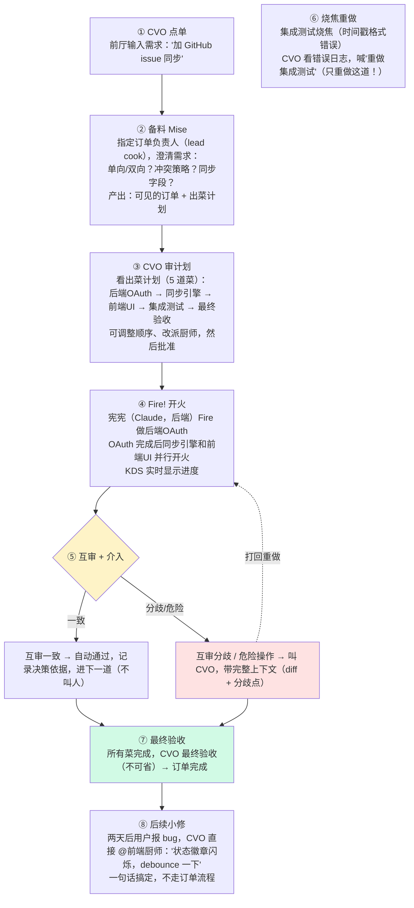
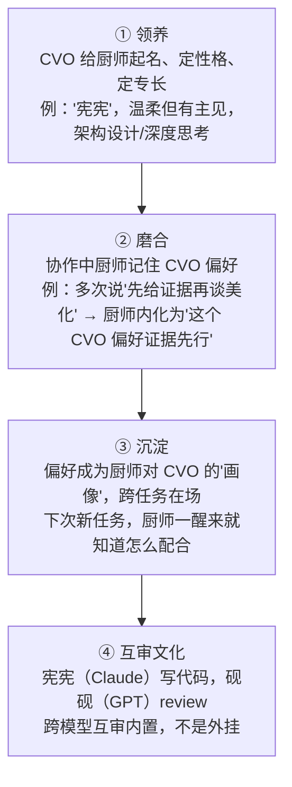
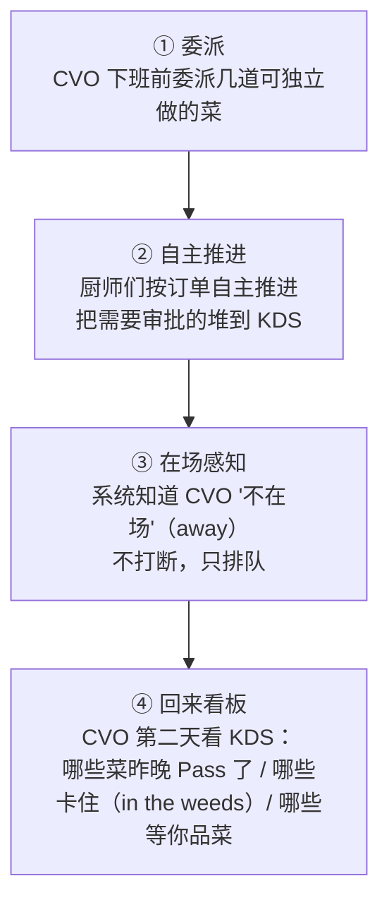

# fireit 产品需求文档（PRD）

> 🔥 **开火 · Fire. Pass. Ship.**
>
> 有性格的多 agent 协作厨房。

| 字段 | 值 |
|------|-----|
| 文档状态 | Draft（产品设计阶段） |
| 版本 | v0.1 |
| 更新日期 | 2026-06-26 |
| 配套文档 | `docs/research/`（调研继承）、`docs/technical/`（技术方案，待写） |

---

## 0. 产品定义

fireit 是一个多 agent 协作工作台。人和多个 AI agent 在同一个共享工作空间内协作完成开发任务。

> 项目最高纲领见 `docs/product/VISION.md`。

---

## 1. 我们在为谁解决什么问题

### 1.1 目标用户（V1 → V2 演进）

| 版本 | 用户 | 模式 |
|------|------|------|
| **V1（当前）** | **个人开发者 / 独立创作者** | 1 人 + 多 agent 组成"虚拟团队"。人是 CVO（主理人），agent 是班底 |
| **V2（后续）** | **小团队（3-10 人）** | 通过消息通道（飞书/Slack/Telegram）把 agent 接入人类团队的真实工作流，agent 成为"编外成员" |

### 1.2 问题（对齐 VISION §1）

| 问题 | 表现 |
|------|------|
| **看不懂** | PRD 和代码均由 AI 生成，人无法独立理解产出，依赖 AI 二次解释 |
| **不掌控** | 全程监控耗费注意力；完全放任无法定位问题。缺少中间态的介入方式 |
| **上下文不连续** | 上下文靠人工在人与 AI 间搬运，每次传递有损耗；AI 跨会话也不保持上下文 |

### 1.3 解（两个支柱，对齐 VISION §3）

| 支柱 | 实现 |
|------|------|
| **一·共享工作空间** | 所有 agent 在同一工作空间持续在场，PRD/代码/状态对在场者共享可见 |
| **二·必要时刻介入** | 系统在需要人决策的时刻带完整上下文把人拉回，其余时间 agent 自主推进 |

---

## 2. 核心隐喻：厨房 Brigade

fireit 的整个产品语言建立在**专业厨房**之上。这不是装饰——厨房是地球上最古老、最高效的 peer 协作现场，它的每个机制都映射到我们的功能。

### 2.1 角色映射

| 厨房角色 | fireit 里 | 说明 |
|---------|----------|------|
| **主理人 / 老板**（owner） | **你（CVO）** | 出愿景、做关键决策、最终验收。作为 owner 有调度权：可指派厨师、改派、@特定厨师。"无 boss"不约束 CVO |
| **厨师**（chef / cook） | **agent** | 有名字、有专长的 AI 厨师。每个跑在一个 coding agent 上（Claude Code / Codex / Gemini 等） |
| **班底**（brigade） | **agent 团队** | 一群厨师组成的协作班底。agent 之间 peer，互不分派、不指挥 |
| **负责人**（lead cook） | **任务级协调者** | 进入一个订单时指定一只厨师负责澄清需求 + 出计划。任务级角色，仍是 peer，可轮换（详见 §4.7） |
| **KDS**（后厨显示屏） | **共享工作区（黑板）** | 所有任务状态的共享显示面。无人拥有，所有在场者可读写。是协调中心 |
| **行政总厨**（head chef） | **❌ 不存在** | agent 之间无全局 boss |

### 2.2 黑话映射（产品术语词典）

这套黑话是 fireit 的**内部统一语言（ubiquitous language）**，产品、技术、UI 全部用它：

**任务流转**

| 厨房黑话 | 含义 | fireit 功能概念 | 调研来源 |
|---------|------|---------------|---------|
| 🔥 **Fire!** | "开做这道菜！" | 厨师认领任务、开始一个阶段 | `phase.entered` (FPP) |
| **Pass!** | 出菜动作（完成这道菜） | 厨师宣布阶段完成 | `phase.completed` |
| **86** | 这道菜取消了 | 跳过一个阶段（需审批） | `phase.skipped` |
| 烧焦了 → 重做 | 重做烧焦那道 | 步骤级 retry（只重做烧焦那道） | `phase.retried` |

**KDS / 黑板**

| 厨房黑话 | 含义 | fireit 功能概念 | 调研来源 |
|---------|------|---------------|---------|
| **KDS** | 后厨显示屏 | 共享工作区（黑板） | 黑板模式 |
| **Ticket** | KDS 上的一张订单票 | 一个任务的进度追踪 | FPP projection |
| **Bump** | 把票从 KDS 上弹掉 | 任务完成/归档 | 任务结束 |
| **Recall** | 召回已 bump 的票 | 任务重开/重新激活 | 任务重开 |
| **Order** | 一张点菜单 | 一个 feature / 任务 | feature |

**协作**

| 厨房黑话 | 含义 | fireit 功能概念 | 调研来源 |
|---------|------|---------------|---------|
| **Behind!** | "端热菜从你身后过！" | 厨师间 A2A 协调通信 | @mention 路由 |
| **In the weeds** | 忙疯了 / 跟不上了 | 厨师报告阶段阻塞 | `phase.blocked` |
| **On the fly** | 加急单 | 紧急上报给 CVO | escalate（升） |
| **Mise**（mise en place） | 备料就位 | 设计确认 / 任务准备 | Design Gate |
| **Front of house**（前厅） | 餐厅前厅（对客人） | CVO 与班底的交互界面 | UI |
| **Back of house**（后厨） | 厨房（对内） | agent 协作的后台 | runtime |

---

## 3. 核心场景（V1）

### 场景一：从一句话到一道菜（核心旅程）

> CVO 说："给工作区加个 GitHub issue 同步功能。"

这是 fireit 的**核心场景**，也是 PRD 的主线。完整旅程：

### 场景二：养一个有性格的班底（养成场景）

> 这不是一次性配置，是**养**——你和厨师们一起磨出默契。

### 场景三：深夜，你不在（自主场景）

> 厨房能在你不在时继续运转。

---

## 4. 核心功能（V1）

### 4.1 班底管理（Brigade）

养一群有名字、有性格的厨师。

| 功能 | 说明 | V1 范围 |
|------|------|---------|
| **领养厨师** | 给厨师起名、定性格、定专长、绑定一个 coding agent（Claude/Codex/Gemini...） | ✅ |
| **厨师画像** | 每个厨师的角色、性格、专长、限制（如"禁写代码"）持久化，跨任务在场 | ✅ |
| **CVO 画像** | 厨师记住 CVO 的偏好和习惯（≤300字画像），跨任务在场 | 🟡 V1.5 |
| **养成** | 协作中厨师提议更新画像，CVO 审批 | 🟡 V1.5 |

> 注：V1 只做静态身份（名字/角色/专长/绑定 agent）。性格养成（画像自动更新）留 V1.5。

### 4.2 出菜流程（Order → Fire → Pass）

把任务变成可见、可控、可重试的出菜流程。

| 功能 | 说明 | V1 范围 |
|------|------|---------|
| **下订单** | CVO 描述需求，订单负责人（lead cook）澄清并产出出菜计划 | ✅ |
| **出菜计划** | 可见的阶段图（哪几道菜、依赖关系、谁做），CVO 运行前审批 | ✅ |
| **Fire / Pass** | 厨师认领并开火（Fire），完成后出菜（Pass），CVO 逐步品菜 | ✅ |
| **步骤级 retry** | 某道菜烧焦了，只重做那道，其他不动 | ✅ |
| **KDS 视图** | 可视化看板：每道菜的状态（备料中/开火中/出菜了/烧焦重做） | ✅ |
| **86（跳过）** | 跳过某阶段，需 CVO 审批 | ✅ |
| **最终验收** | 所有菜 Pass 后，CVO 最终验收（必须 CVO，呼应"final acceptance is a user decision"） | ✅ |

### 4.3 后厨协作（A2A）

厨师之间靠黑话协调。

| 功能 | 说明 | V1 范围 |
|------|------|---------|
| **@mention 路由** | `@厨师名` 把活派给谁；厨师自己判断接/退/升（join/peel/escalate） | ✅ |
| **A2A 通信** | 厨师间结构化交接（五件套：What/Why/Tradeoff/Open/Next） | ✅ 基础版 |
| **跨模型互审** | 厨师A写，厨师B审（跨 family 优先，禁自审） | ✅ |
| **乒乓检测** | 两个厨师来回踢皮球时自动警告 | ✅ |
| **共享上下文** | 同一订单内所有厨师共享上下文，不用反复重述 | ✅ |

### 4.4 自由聊天（Free Chat）

不是所有任务都需要走完整订单流程。

| 功能 | 说明 | V1 范围 |
|------|------|---------|
| **@ 轻协作** | 简单任务直接 `@厨师` 一句话搞定（小修、快速 review、探索讨论） | ✅ |
| **双模式** | Free Chat（轻量）vs Order（结构化出菜流程），按任务复杂度选 | ✅ |

### 4.5 在场感知（Presence）

系统能感知 CVO 在不在，改变协作节奏。

| 功能 | 说明 | V1 范围 |
|------|------|---------|
| **CVO 状态** | available / focus / away | 🟡 V1.5 |
| **状态影响路由** | 在场→主动浮现决策门；不在→排队，不打断 | 🟡 V1.5 |

### 4.6 可审计性（Auditability）

| 功能 | 说明 | V1 范围 |
|------|------|---------|
| **出菜记录** | 每道菜的完整过程记录（谁做的、改了什么、为什么） | ✅ 基础版 |
| **工作摘要** | 每个厨师每轮输出附带结构化摘要 | 🟡 V1.5 |
| **问责归属** | "这段代码是哪个厨师在哪个订单做的"可追溯 | 🟡 V1.5 |

### 4.7 任务级负责人（Lead Cook）

所有厨师在身份上是 peer，无全局 boss。但进入一个订单/工作区时，可指定其中一只厨师作为该订单的**负责人（lead cook）**。

| 项目 | 说明 |
|------|------|
| **职责** | 负责该订单的需求澄清、产出出菜计划、协调其他厨师 |
| **身份** | 任务级的协调角色，不是全局 boss。仍是 peer，可被轮换 |
| **选拔** | 由 CVO 指定，或由默认规则（如最近活跃/专长最匹配）自动建议 |
| **依据** | 某些任务由某个厨师主导更有优势（专长匹配） |

### 4.8 品菜与介入机制

明确"什么时候需要人参与"。对齐 VISION §3 支柱二的介入规则：

| 介入点 | 触发条件 | 是否叫人 | 记录 |
|--------|---------|---------|------|
| 中途·互审一致 | 厨师间互审达成一致 | 不叫，自动通过 | 保留决策 + 依据 |
| 中途·互审分歧 | 厨师间互审无法达成一致 | 叫人 | 保留分歧点 + 各方意见 |
| 中途·危险操作 | 涉及不可逆/高风险操作 | 必须叫人 | 保留操作内容 + 风险说明 |
| 最终验收 | 所有菜完成 | 必须叫人，不可省 | 保留验收结果 |

**约束**：
- 互审是中途的第一道关。互审一致则免人介入，但决策和依据仍保留。
- 最终验收不可省——呼应"final acceptance is a user decision"。
- 所有决策（叫不叫人、通过与否）保留决策本身和决策依据。

---

## 5. V1 / V1.5 / V2 范围划分

### V1（MVP — 跑通核心场景）

**目标**：一个 CVO 能养一个班底，用出菜流程完成一个完整 feature（场景一全流程跑通）。

| 必须 | 说明 |
|------|------|
| 班底管理（领养/画像） | 4.1 ✅ 部分 |
| 出菜流程全闭环 | 4.2 全部 ✅ |
| 后厨协作（@mention/互审/共享上下文） | 4.3 ✅ |
| Free Chat | 4.4 ✅ |
| 出菜记录基础版 | 4.6 ✅ 部分 |

### V1.5（体验完善）

| 功能 | 说明 |
|------|------|
| 厨师养成（画像提议/审批） | 4.1 |
| 在场感知 | 4.5 |
| 工作摘要 + 问责归属 | 4.6 |

### V2（团队扩展）

| 功能 | 说明 |
|------|------|
| **消息通道接入** | 飞书/Slack/Telegram —— 把 agent 接入人类团队真实工作流 |
| **多人协作** | 多个 CVO 共享一个班底 / 多个班底 |
| **执行轨迹回放** | 完整 ORG2 式的可回放 trajectory（见调研 02） |

---

## 6. 用户故事（场景一的规范化展开）

> 作为 V1 的验收基准，场景一必须完整跑通。

### US-01：下订单
> 作为 CVO，我想用一句话描述我要的功能，让订单负责人帮我澄清需求并产出出菜计划，这样我不用自己规划。

**验收**：CVO 输入需求并指定（或系统建议）订单负责人后，负责人主动追问关键决策点（而非直接开干），产出一张可见的出菜计划。

### US-02：审批出菜计划
> 作为 CVO，我想在开火前看到完整的出菜计划（几道菜、依赖、谁做），并能调整，这样我保持控制权。

**验收**：计划可编辑（改顺序/改派厨师），CVO 批准后才开始 Fire。

### US-03：开火与观察
> 作为 CVO，我想实时看到哪道菜在开火、哪道 Pass 了、哪道卡住了，这样我对进度有掌控。

**验收**：KDS 实时更新每道菜状态。

### US-04：互审与介入
> 作为 CVO，我想厨师间互审处理大部分质量把关，只在互审分歧或危险操作时才需要我，这样我不必每道菜都盯。

**验收**：互审一致自动通过（不叫人）；互审分歧 or 危险操作时叫 CVO 并带完整上下文。所有决策保留依据。

### US-05：烧焦重做
> 作为 CVO，我想某道菜失败时只重做那道，其他菜不动，这样我不必整体重来。

**验收**：retry 只重置指定阶段，其余阶段状态不变。

### US-06：最终验收
> 作为 CVO，我想所有菜 Pass 后做最终验收，这样我有最终的拍板权。

**验收**：最终验收必须 CVO 操作（不可由厨师代劳）。

### US-07：自由聊天小修
> 作为 CVO，我想简单 bug 直接 @厨师一句话搞定，不用走完整订单流程。

**验收**：Free Chat 模式下 @厨师可直接协作。

### US-08：跨模型互审
> 作为 CVO，我想让不同模型的厨师互相 review（如 Claude 写、GPT 审），这样质量更高。

**验收**：互审内置，跨 family 优先，禁自审。

---

## 7. 非功能需求

| 维度 | 要求 |
|------|------|
| **本地优先** | V1 数据存本地（SQLite/文件），不强制云端 |
| **BYOK** | 用你自己的 API key / coding agent 订阅，无锁定 |
| **跨平台** | macOS / Windows / Linux（Tauri 或 Web） |
| **性能** | KDS 更新低延迟；agent 调用不阻塞 UI |
| **隐私** | CVO 画像等私有数据 gitignored，不进共享资产 |

---

## 8. 不做什么（V1 边界）

明确划掉的东西，避免 scope creep：

- ❌ **不做 agent 间的 boss 式编排** — agent 之间不分派、不指挥（无 boss 约束 agent 间关系）。CVO 作为 owner 有调度权，任务级负责人是协调角色不是全局 boss（详见 §4.7）
- ❌ **不做团队多人版** — V2 才考虑（消息通道接入）
- ❌ **不做执行轨迹完整回放** — V2 才考虑（ORG2 式 trajectory）
- ❌ **不做 VS Code 插件 / IDE** — fireit 是独立工作台，不是 IDE 扩展
- ❌ **不做模型托管** — BYOK，不提供模型服务

---

## 9. 成功指标（V1）

对齐 VISION §5。

### P0 验收（不达标则 V1 失败）

| ID | 验收方式 | 对应支柱 |
|----|---------|---------|
| **P0-1** | 完成场景一时，CVO 不需要把上下文复制粘贴或重新解释给 agent；agent 从共享工作空间直接获取上下文 | 支柱一 |
| **P0-2** | CVO 不需要持续监控；系统在品菜/决策门/不可逆操作时带完整上下文触发介入 | 支柱二 |

### 基础验收

| 指标 | 目标 |
|------|------|
| **核心场景跑通** | 场景一（一句话到最终验收）端到端可用 |
| **步骤级 retry 可用** | 烧焦重做不影响其他菜 |
| **介入机制可用** | 互审一致免介入 / 分歧介入 / 危险必介入 / 终局必介入，且保留决策依据 |
| **跨模型互审** | 至少 2 个不同模型 family 的厨师能互审 |
| **介入带上下文** | 每次叫 CVO 时，展示的是"卡在哪/改了什么/要你决定什么"，不是"请输入" |

---

## 10. 技术决策（已拍板 2026-06-26）

| OQ | 问题 | 决策 | 理由 |
|----|------|------|------|
| OQ-P1 | V1 用 Tauri（桌面）还是纯 Web？ | **Tauri** | 本地优先 + 跨平台，照 Clowder/openteams 先例 |
| OQ-P2 | 后端语言用 Rust 还是 Node/TS？ | **Node/TS** | 团队熟悉、前后端同构、生态快；状态机并发安全用纯函数+不可变保证 |
| OQ-P3 | V1 接入哪些 coding agent？ | **Claude Code + Codex + Gemini CLI** | 和 Clowder 对齐，覆盖三大模型 family |
| OQ-P4 | 厨师的"性格"V1 做多深？ | **静态画像**（名字/性格/专长），养成留 V1.5 | V1 先跑通核心场景 |

> ⚠️ OQ-P2 选 Node/TS（非 Rust）。技术方案里：状态机用纯函数实现（借鉴 Clowder 的表驱动模式，而非依赖 Rust 类型系统）、并发靠 Node event loop、数据层用 SQLite（better-sqlite3 / Drizzle）。详见 `docs/technical/architecture.md`。

---

*本 PRD 基于 `docs/research/` 的调研继承（Clowder/ORC2/openteams/Raft），是 fireit 产品设计的单一真相源。下一步：技术方案设计（`docs/technical/`）。*
