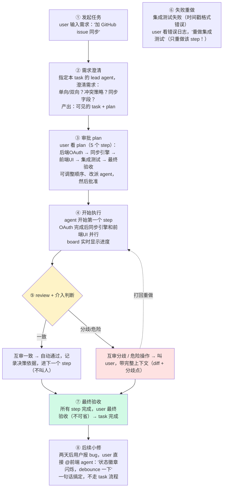
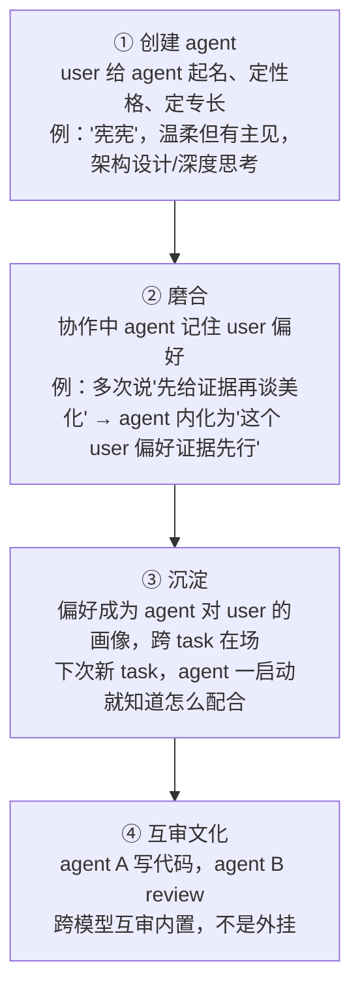
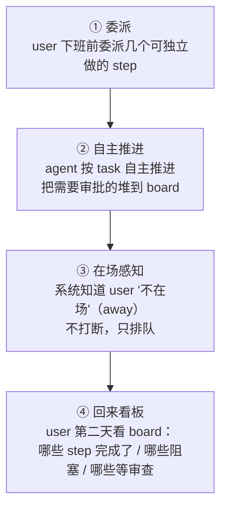

# fireit 产品需求文档（PRD）

> 🔥 **开火 · Fire. Pass. Ship.**
>
> 多 agent 协作工作台。

| 字段 | 值 |
|------|-----|
| 文档状态 | Draft（产品设计阶段） |
| 版本 | v0.2 |
| 更新日期 | 2026-06-26 |
| 配套文档 | `docs/product/VISION.md`、`docs/technical/architecture.md` |

---

## 0. 产品定义

fireit 是一个多 agent 协作工作台。人和多个 AI agent 在同一个共享工作空间内协作完成开发任务。

> 项目最高纲领见 `docs/product/VISION.md`。品牌语言（厨房黑话）见 `README.md`，仅用于对外表达，不用于工程。

---

## 1. 术语表（工程术语，代码与文档统一）

本表是 PRD 和代码的**唯一术语源**。

| 工程术语 | 类型 | 含义 |
|---------|------|------|
| **user / owner** | 人 | 任务发起者，有调度权与最终验收权 |
| **agent** | 协作者 | 一个有身份的 AI 协作者，绑定一个 coding agent（Claude Code/Codex/Gemini CLI） |
| **team** | 集合 | 一组 agent |
| **lead agent** | 任务级角色 | 某个 task 的协调者，负责需求澄清与产出 plan；仍是 peer，可轮换 |
| **task** | 主实体 | 一个要完成的任务 |
| **step** | 工作单元 | task 拆解出的一个阶段，可独立 retry |
| **plan** | 结构 | task 拆解出的 step 序列，含依赖关系 |
| **board** | 共享状态 | 共享工作空间，所有 task/step 状态的读写面 |
| **review** | 行为 | 审查，含 agent 间互审与人工介入 |

> 品牌类比（厨房黑话）对照见 `docs/product/VISION.md` §6，不用于工程。

---

## 2. 目标用户与问题

### 2.1 目标用户（V1 → V2 演进）

| 版本 | 用户 | 模式 |
|------|------|------|
| **V1（当前）** | **个人开发者 / 独立创作者** | 1 人 + 多 agent 组成虚拟团队。人是 owner，agent 是 team |
| **V2（后续）** | **小团队（3-10 人）** | 通过消息通道（飞书/Slack/Telegram）把 agent 接入人类团队工作流 |

### 2.2 问题（对齐 VISION §1）

| 问题 | 表现 |
|------|------|
| **看不懂** | PRD 和代码均由 AI 生成，人无法独立理解产出，依赖 AI 二次解释 |
| **不掌控** | 全程监控耗费注意力；完全放任无法定位问题。缺少中间态的介入方式 |
| **上下文不连续** | 上下文靠人工在人与 AI 间搬运，每次传递有损耗；AI 跨会话也不保持上下文 |

### 2.3 解（两个支柱，对齐 VISION §3）

| 支柱 | 实现 |
|------|------|
| **一·共享工作空间** | 所有 agent 在同一工作空间持续在场，PRD/代码/状态对在场者共享可见 |
| **二·必要时刻介入** | 系统在需要人决策的时刻带完整上下文把人拉回，其余时间 agent 自主推进 |

---

## 3. 核心场景（V1）

### 场景一：从一句话到一个 task（核心旅程）

> user 说："给工作区加个 GitHub issue 同步功能。"

这是 fireit 的**核心场景**，也是 PRD 的主线。完整旅程：

### 场景二：养一个 team（身份沉淀场景）

### 场景三：深夜，人不在（自主场景）

---

## 4. 核心功能（V1）

### 4.1 team 管理

| 功能 | 说明 | V1 范围 |
|------|------|---------|
| **创建 agent** | 给 agent 起名、定角色、定专长、绑定一个 coding agent（Claude/Codex/Gemini） | ✅ |
| **agent 身份** | 每个 agent 的角色、专长、限制持久化，跨 task 在场 | ✅ |
| **user 画像** | agent 记住 user 的偏好和习惯（≤300字画像），跨 task 在场 | 🟡 V1.5 |
| **养成** | 协作中 agent 提议更新画像，user 审批 | 🟡 V1.5 |

> 注：V1 只做静态身份（名字/角色/专长/绑定 agent）。画像养成留 V1.5。

### 4.2 task 流程（task → step → review）

把任务变成可见、可控、可重试的流程。

| 功能 | 说明 | V1 范围 |
|------|------|---------|
| **创建 task** | user 描述需求，lead agent 澄清并产出 plan | ✅ |
| **plan** | 可见的 step 序列（哪些 step、依赖关系、谁做），user 执行前审批 | ✅ |
| **step 执行** | agent 认领并开始（started），完成后（completed），逐步 review | ✅ |
| **step 级 retry** | 某个 step 失败，只重做该 step，其他不动 | ✅ |
| **board 视图** | 可视化看板：每个 step 的状态（待执行/执行中/完成/阻塞/重做） | ✅ |
| **skip** | 跳过某 step，需 user 审批 | ✅ |
| **最终验收** | 所有 step 完成后，user 最终验收（必须 user，不可由 agent 代劳） | ✅ |

### 4.3 agent 间协作（A2A）

| 功能 | 说明 | V1 范围 |
|------|------|---------|
| **@mention 路由** | `@agent名` 指定协作对象；agent 自己判断接/退/升（join/peel/escalate） | ✅ |
| **A2A 通信** | agent 间结构化交接（五件套：What/Why/Tradeoff/Open/Next） | ✅ 基础版 |
| **跨模型互审** | agent A 做，agent B 审（跨 family 优先，禁自审） | ✅ |
| **乒乓检测** | 两个 agent 来回推诿时自动警告 | ✅ |
| **共享上下文** | 同一 task 内所有 agent 共享上下文，不重复传递 | ✅ |

### 4.4 自由聊天（free chat）

不是所有任务都需要走完整 task 流程。

| 功能 | 说明 | V1 范围 |
|------|------|---------|
| **@ 轻协作** | 简单任务直接 `@agent` 一句话搞定（小修、快速 review、探索讨论） | ✅ |
| **双模式** | free chat（轻量）vs task（结构化流程），按任务复杂度选 | ✅ |

### 4.5 在场感知（presence）

| 功能 | 说明 | V1 范围 |
|------|------|---------|
| **user 状态** | available / focus / away | 🟡 V1.5 |
| **状态影响路由** | 在场→主动浮现决策点；不在→排队，不打断 | 🟡 V1.5 |

### 4.6 可审计性（auditability）

| 功能 | 说明 | V1 范围 |
|------|------|---------|
| **执行记录** | 每个 step 的完整过程记录（谁做的、改了什么、为什么） | ✅ 基础版 |
| **工作摘要** | 每个 agent 每轮输出附带结构化摘要 | 🟡 V1.5 |
| **问责归属** | "这段代码是哪个 agent 在哪个 task 做的"可追溯 | 🟡 V1.5 |

### 4.7 任务级 lead agent

所有 agent 在身份上是 peer，无全局 boss。但创建一个 task 时，可指定其中一个 agent 作为该 task 的 **lead agent**。

| 项目 | 说明 |
|------|------|
| **职责** | 负责该 task 的需求澄清、产出 plan、协调其他 agent |
| **身份** | 任务级协调角色，不是全局 boss；仍是 peer，可被轮换 |
| **选拔** | 由 user 指定，或由默认规则（如最近活跃/专长最匹配）自动建议 |
| **依据** | 某些任务由某个 agent 主导更有优势（专长匹配） |

### 4.8 review 与介入机制

明确"什么时候需要人参与"。对齐 VISION §3 支柱二的介入规则：

| 介入点 | 触发条件 | 是否叫人 | 记录 |
|--------|---------|---------|------|
| 中途·互审一致 | agent 间互审达成一致 | 不叫，自动通过 | 保留决策 + 依据 |
| 中途·互审分歧 | agent 间互审无法达成一致 | 叫人 | 保留分歧点 + 各方意见 |
| 中途·危险操作 | 涉及不可逆/高风险操作 | 必须叫人 | 保留操作内容 + 风险说明 |
| 最终验收 | 所有 step 完成 | 必须叫人，不可省 | 保留验收结果 |

**约束**：
- 互审是中途的第一道关。互审一致则免人介入，但决策和依据仍保留。
- 最终验收不可省——呼应"final acceptance is a user decision"。
- 所有决策（叫不叫人、通过与否）保留决策本身和决策依据。

---

## 5. V1 / V1.5 / V2 范围划分

### V1（MVP — 跑通核心场景）

**目标**：一个 user 能组建一个 team，用 task 流程完成一个完整任务（场景一全流程跑通）。

| 必须 | 说明 |
|------|------|
| team 管理（创建/身份） | 4.1 ✅ 部分 |
| task 流程全闭环 | 4.2 全部 ✅ |
| agent 间协作（@mention/互审/共享上下文） | 4.3 ✅ |
| free chat | 4.4 ✅ |
| 执行记录基础版 | 4.6 ✅ 部分 |

### V1.5（体验完善）

| 功能 | 说明 |
|------|------|
| 画像养成（提议/审批） | 4.1 |
| 在场感知 | 4.5 |
| 工作摘要 + 问责归属 | 4.6 |

### V2（团队扩展）

| 功能 | 说明 |
|------|------|
| **消息通道接入** | 飞书/Slack/Telegram —— 把 agent 接入人类团队真实工作流 |
| **多人协作** | 多个 user 共享一个 team / 多个 team |
| **执行轨迹回放** | 完整可回放的 trajectory |

---

## 6. 用户故事（场景一的规范化展开）

> 作为 V1 的验收基准，场景一必须完整跑通。

### US-01：创建 task
> 作为 user，我想用一句话描述我要的功能，让 lead agent 帮我澄清需求并产出 plan，这样我不用自己规划。

**验收**：user 输入需求并指定（或系统建议）lead agent 后，lead agent 主动追问关键决策点（而非直接开干），产出一张可见的 plan。

### US-02：审批 plan
> 作为 user，我想在执行前看到完整的 plan（哪些 step、依赖、谁做），并能调整，这样我保持控制权。

**验收**：plan 可编辑（改顺序/改派 agent），user 批准后才开始执行。

### US-03：执行与观察
> 作为 user，我想实时看到哪个 step 在执行、哪个完成了、哪个阻塞了，这样我对进度有掌控。

**验收**：board 实时更新每个 step 状态。

### US-04：互审与介入
> 作为 user，我想 agent 间互审处理大部分质量把关，只在互审分歧或危险操作时才需要我，这样我不必每个 step 都盯。

**验收**：互审一致自动通过（不叫人）；互审分歧 or 危险操作时叫 user 并带完整上下文。所有决策保留依据。

### US-05：失败重做
> 作为 user，我想某个 step 失败时只重做该 step，其他不动，这样我不必整体重来。

**验收**：retry 只重置指定 step，其余 step 状态不变。

### US-06：最终验收
> 作为 user，我想所有 step 完成后做最终验收，这样我有最终的拍板权。

**验收**：最终验收必须 user 操作（不可由 agent 代劳）。

### US-07：自由聊天小修
> 作为 user，我想简单 bug 直接 @agent 一句话搞定，不用走完整 task 流程。

**验收**：free chat 模式下 @agent 可直接协作。

### US-08：跨模型互审
> 作为 user，我想让不同模型的 agent 互相 review（如 Claude 写、GPT 审），这样质量更高。

**验收**：互审内置，跨 family 优先，禁自审。

---

## 7. 非功能需求

| 维度 | 要求 |
|------|------|
| **本地优先** | V1 数据存本地（SQLite/文件），不强制云端 |
| **BYOK** | 用你自己的 API key / coding agent 订阅，无锁定 |
| **跨平台** | macOS / Windows / Linux（Tauri） |
| **性能** | board 更新低延迟；agent 调用不阻塞 UI |
| **隐私** | user 画像等私有数据 gitignored，不进共享资产 |

---

## 8. 不做什么（V1 边界）

明确划掉的东西，避免 scope creep：

- ❌ **不做 agent 间的 boss 式编排** — agent 之间不分派、不指挥（无 boss 约束 agent 间关系）。user 作为 owner 有调度权，任务级 lead agent 是协调角色不是全局 boss（详见 §4.7）
- ❌ **不做团队多人版** — V2 才考虑（消息通道接入）
- ❌ **不做执行轨迹完整回放** — V2 才考虑
- ❌ **不做 VS Code 插件 / IDE** — fireit 是独立工作台，不是 IDE 扩展
- ❌ **不做模型托管** — BYOK，不提供模型服务

---

## 9. 成功指标（V1）

对齐 VISION §5。

### P0 验收（不达标则 V1 失败）

| ID | 验收方式 | 对应支柱 |
|----|---------|---------|
| **P0-1** | 完成场景一时，user 不需要把上下文复制粘贴或重新解释给 agent；agent 从共享工作空间直接获取上下文 | 支柱一 |
| **P0-2** | user 不需要持续监控；系统在 review/决策点/不可逆操作时带完整上下文触发介入 | 支柱二 |

### 基础验收

| 指标 | 目标 |
|------|------|
| **核心场景跑通** | 场景一（一句话到最终验收）端到端可用 |
| **step 级 retry 可用** | 失败重做不影响其他 step |
| **介入机制可用** | 互审一致免介入 / 分歧介入 / 危险必介入 / 终局必介入，且保留决策依据 |
| **跨模型互审** | 至少 2 个不同模型 family 的 agent 能互审 |
| **介入带上下文** | 每次叫 user 时，展示的是"卡在哪/改了什么/要你决定什么"，不是"请输入" |

---

## 10. 技术决策（已拍板 2026-06-26）

| OQ | 问题 | 决策 | 理由 |
|----|------|------|------|
| OQ-P1 | V1 用 Tauri（桌面）还是纯 Web？ | **Tauri** | 本地优先 + 跨平台 |
| OQ-P2 | 后端语言用 Rust 还是 Node/TS？ | **Node/TS** | 团队熟悉、前后端同构、生态快 |
| OQ-P3 | V1 接入哪些 coding agent？ | **Claude Code + Codex + Gemini CLI** | 覆盖三大模型 family |
| OQ-P4 | agent 身份 V1 做多深？ | **静态身份**（名字/角色/专长），养成留 V1.5 | V1 先跑通核心场景 |

> ⚠️ OQ-P2 选 Node/TS。状态机用纯函数实现、并发靠 Node event loop、数据层用 SQLite（better-sqlite3 / Drizzle）。详见 `docs/technical/architecture.md`。

---

*本 PRD 是 fireit 产品设计的单一真相源。术语以 §1 为准。*
