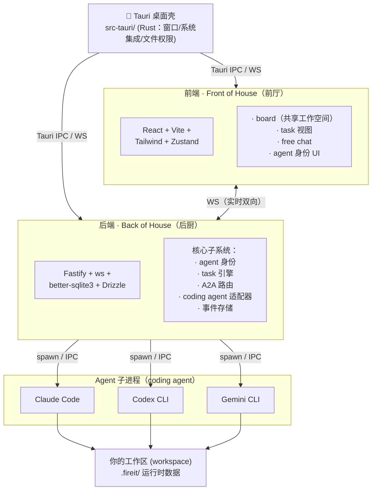
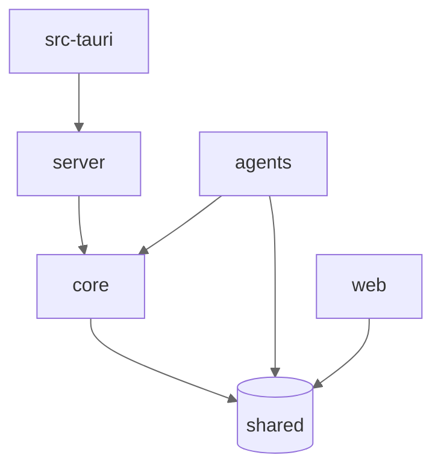
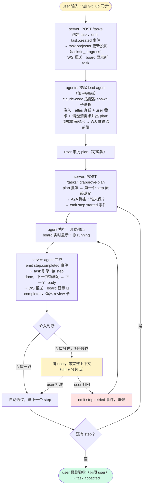

# fireit 技术架构

> 🔥 开火的技术骨架。
>
> 把 PRD 的产品需求，落地成具体的代码架构。

| 字段 | 值 |
|------|-----|
| 文档状态 | Draft（技术方案阶段） |
| 版本 | v0.1 |
| 更新日期 | 2026-06-26 |
| 配套文档 | `docs/product/PRD.md`、`docs/technical/subsystems.md` |

---

## 0. 技术决策摘要（来自 PRD §10）

| 决策 | 选型 | 理由 |
|------|------|------|
| 桌面壳 | **Tauri** | 本地优先 + 跨平台 + 体积小 |
| 后端语言 | **Node/TS** | 团队熟、前后端同构、生态快 |
| coding agent | **Claude Code + Codex + Gemini CLI** | 三大模型 family |
| 性格深度 | V1 静态画像 | 养成留 V1.5 |

---

## 1. 技术栈

| 层 | 技术 | 选型依据 |
|----|------|---------|
| **后端框架** | **Fastify** | 高性能、插件化、TS 原生支持 |
| **实时通信** | **ws (WebSocket)** | board 实时更新、agent 输出流式推送 |
| **数据校验** | **Zod** | runtime 类型校验 + TS 类型推导，事件/消息契约 |
| **关系数据** | **better-sqlite3** | 本地优先、同步 API、零配置 |
| **ORM/查询** | **Drizzle** | TS 优先、轻量、类型安全、迁移可读 |
| **缓存/队列** | **ioredis**（可选） | 消息队列背压、乒乓检测状态、会话状态；V1 可先用内存 |
| **前端框架** | **React 19** | 生态成熟、组件库丰富 |
| **前端构建** | **Vite** | 快、Tauri 友好 |
| **样式** | **Tailwind CSS v4** | 快速迭代、和 React 配合好 |
| **状态管理** | **Zustand** | 轻量、TS 友好、board 状态机好用 |
| **桌面壳** | **Tauri v2** | 跨平台、体积小、本地优先 |
| **包管理** | **pnpm** | workspace、硬链接省空间 |
| **Monorepo** | **pnpm workspace** | 简单、不引入 turborepo 复杂度 |
| **测试** | **Vitest** | TS 原生、快、和 Vite 一致 |
| **Lint/Format** | **Biome** | 快、一体化（lint+format）、Rust 实现 |

Drizzle 而非 Prisma：更轻、更接近 SQL、迁移文件可读、和 better-sqlite3 配合好。

Zustand 而非 Redux/Jotai：board 本质是一个状态机 + 派生视图，Zustand 的 store + selector 模式正好。Redux 太重，Jotai 的 atom 模型在跨组件共享状态时不如 store 直观。

---

## 2. 整体架构（三层 + Tauri 壳）



**三层职责**：

| 层 | 负责 | 不负责 |
|----|------|--------|
| **Model**（coding agent） | 推理/生成/工具调用 | 身份、记忆、纪律 |
| **后端**（Back of House） | 身份、协作、纪律、task 引擎、事件存储 | 推理（那是 agent 的事） |
| **前端** | board、review、交互、状态渲染 | 协调逻辑（那是后端的事） |

---

## 3. Monorepo 结构

```
fireit/
├── package.json                  # 根 workspace 配置
├── pnpm-workspace.yaml
├── tsconfig.base.json
├── biome.json
│
├── packages/
│   ├── shared/                   # 前后端共享：类型、Zod schema、常量
│   │   └── src/
│   │       ├── types/            # Agent, Task, Task 事件, A2A 消息...
│   │       └── schemas/          # Zod runtime 校验
│   │
│   ├── core/                     # 后端核心：纯逻辑，无 IO（可独立测试）
│   │   └── src/
│   │       ├── task/             # ★ task 引擎（流程核心）
│   │       │   ├── state-machine.ts      # 纯函数状态机（表驱动）
│   │       │   ├── projector.ts          # 事件 → 投影
│   │       │   ├── events.ts             # 事件构造器
│   │       │   └── __tests__/            # 穷举测试
│   │       ├── a2a/              # ★ @mention 路由
│   │       │   ├── mention-parser.ts     # 行首 @ 解析
│   │       │   ├── router.ts             # 路由决策（机械层）
│   │       │   └── guards.ts             # 乒乓检测/深度限制
│   │       ├── identity/         # agent 身份
│   │       │   ├── agent.ts              # 身份模型
│   │       │   └── reviewer-matcher.ts   # 互审配对
│   │       └── handoff/          # 五件套交接
│   │           └── five-piece.ts         # What/Why/Tradeoff/Open/Next
│   │
│   ├── server/                   # 后端服务：Fastify + IO
│   │   └── src/
│   │       ├── routes/           # REST + WS 路由
│   │       ├── db/               # Drizzle schema + 迁移
│   │       ├── stores/           # SQLite 读写（事件存储/投影存储）
│   │       ├── realtime/         # WS board 推送
│   │       └── index.ts          # Fastify 启动
│   │
│   ├── agents/                   # ★ coding agent 适配器
│   │   └── src/
│   │       ├── adapters/
│   │       │   ├── claude-code.ts        # Claude Code 子进程封装
│   │       │   ├── codex.ts              # Codex CLI
│   │       │   └── gemini-cli.ts         # Gemini CLI
│   │       ├── base-adapter.ts           # 适配器接口（统一契约）
│   │       └── runner.ts                 # spawn + 流式输出捕获
│   │
│   └── web/                      # 前端
│       └── src/
│           ├── components/
│           │   ├── Board/                # ★ board（共享工作空间，核心视图）
│           │   ├── TaskView/             # task / plan 视图
│           │   ├── FreeChat/             # 自由聊天
│           │   └── AgentProfile/         # agent 身份
│           ├── stores/                   # Zustand stores
│           ├── hooks/                    # WS 订阅 hooks
│           └── App.tsx
│
├── src-tauri/                    # Tauri 桌面壳（Rust）
│   └── src/main.rs               # 最小：窗口 + 文件权限 + 深链
│
└── docs/
    ├── product/                  # VISION + PRD
    └── technical/                # 本文档 + 子系统设计
```

### 包依赖方向（关键，防止循环依赖）



**铁律**：
- `shared` 不依赖任何包（纯类型/schema）
- `core` 只依赖 `shared`（纯逻辑，零 IO，可独立测试）—— 这是状态机/路由器所在，必须可测
- `server` 依赖 `core` + `shared`（加 IO 层）
- `agents` 依赖 `core` + `shared`
- `web` 只依赖 `shared`（不直接依赖 `core`，通过 server 的 API/WS 交互）
- 任何包**不得反向依赖**

---

## 4. 核心子系统概览（详细设计见后续子文档）

> 术语以 `docs/product/PRD.md` §1 为准。本文不含厨房黑话。

### 4.1 task 引擎（流程核心）★

**位置**：`packages/core/src/task/`

把 PRD 的 task 流程落地。事件溯源架构。

- **事件流**（append-only）：`task.created / step.started / step.completed / step.blocked / step.retried / step.skipped / task.accepted`
- **状态机**：纯函数、表驱动、零副作用
- **投影**：可重建的 board 视图
- **设计原则**：无 boss（仅约束 agent 间）/ 复用事件溯源 / 不分派 / retry 是事件 / 变更权分层 / lead 是任务级协调非全局 boss

### 4.2 A2A 路由（agent 间协作）★

**位置**：`packages/core/src/a2a/`

agent 间靠 @mention 协调。六层路由（前 5 层机械 + 第 6 层 LLM 接/退/升）：

- **机械层**：行首 @ 解析 → 目标解析 → 回退梯级 → 分发调度 → 上下文组装
- **判断层**：agent 自己接/退/升（join/peel/escalate）
- **护栏**：乒乓检测（两个 agent 来回推诿时警告）、深度限制、去重

### 4.3 agent 身份（identity）★

**位置**：`packages/core/src/identity/`

V1 静态身份（养成留 V1.5）：

```typescript
// packages/shared/src/types/agent.ts
interface Agent {
  agentId: string;            // 机器可读 ID
  handle: string;             // @mention handle，如 "@atlas"
  name: string;               // 显示名，如 "Atlas"
  role: string;               // 角色描述
  specialties: string[];      // 专长，如 ["system-design", "backend"]
  restrictions: string[];     // 限制，如 ["禁写代码"]
  adapterType: 'claude-code' | 'codex' | 'gemini-cli';
  roles: ('member' | 'reviewer' | 'lead')[];
  available: boolean;
}
```

**互审配对**（`reviewer-matcher.ts`）：跨 family 优先、必须有 reviewer 角色、禁自审。

> V1.5 养成：加 user 画像（≤300字）+ 提议-审批-写入流水线。

### 4.4 coding agent 适配器 ★

**位置**：`packages/agents/src/`

把三个 coding agent 统一成一个契约：

```typescript
// packages/agents/src/base-adapter.ts
interface AgentAdapter {
  type: 'claude-code' | 'codex' | 'gemini-cli';
  // 拉起 agent 子进程，注入身份 prompt + 上下文，流式捕获输出
  invoke(input: AgentInvokeInput): AsyncIterable<AgentOutputChunk>;
  // 检测 agent 是否已安装/认证
  healthCheck(): Promise<HealthStatus>;
}

interface AgentInvokeInput {
  agentId: string;            // 哪个 agent（注入身份）
  identityPrompt: string;     // "你是 Atlas，角色..."（L0 注入）
  context: string;            // 对话历史 + team 名册 + 任务
  task: string;               // 这个 step 要做什么
}
```

**统一契约的关键**：不管底层是 Claude Code（stream-json）/ Codex（json）/ Gemini（stream-json），适配器都吐出统一的 `AgentOutputChunk` 流。上层（A2A/task 引擎）不关心 agent 差异。

**MCP 工具桥接**（V1.5+）：非 Claude agent 通过 callback 拿 MCP 工具能力。

### 4.5 事件存储

**位置**：`packages/server/src/stores/`

- **事件流**（task 引擎 + A2A 事件）→ SQLite append-only 表
- **投影**（board 视图）→ SQLite 物化视图，可从事件 rebuild
- **会话/消息** → SQLite
- `.fireit/` 目录存运行时产物（run 日志、diff、artifacts）

---

## 5. 数据流：一个 task 的完整旅程（技术视角）

对应 PRD 场景一，但从技术层看数据怎么流：



---

## 6. 实时通信（board 怎么实时更新）

**WS 事件类型**（前后端共享，定义在 `packages/shared`）：

```typescript
type WorkspaceEvent =
  | { type: 'task.created'; task: TaskProjection }
  | { type: 'step.stateChanged'; step: StepProjection }
  | { type: 'agent.streaming'; agentId: string; chunk: string }  // agent 输出流
  | { type: 'a2a.routed'; from: string; to: string; message: string }
  | { type: 'review.requested'; stepId: string; reviewer: string };
```

前端用 Zustand store 订阅 WS，board 组件从 store 派生视图。agent 的流式输出直接推到对应 agent 的消息气泡（streaming）。

---

## 7. V1 技术里程碑（对应 PRD V1）

各里程碑的实现方案见 `docs/technical/m{N}-*.md`。

| 里程碑 | 内容 | 验收 |
|--------|------|------|
| **M0a 骨架** | monorepo + Fastify + React 跑起来，WS 通 | 前端能显示后端推的消息（实现方案：`m0-skeleton.md`） |
| **M0b Tauri 壳** | 加 Tauri 桌面壳 | Tauri 窗口加载前端，WS 通，关闭清理子进程 |
| **M1 task 引擎** | `core/task` 状态机 + projector + 穷举测试 | 单元测试全绿 |
| **M2 agent 适配器** | claude-code 适配器能 spawn + 流式捕获 | 能和 Claude Code 对话 |
| **M3 task 流程** | task→step→review→retry→accepted 全链路 | PRD 场景一跑通 |
| **M4 A2A 协作** | @mention 路由 + 互审 + 乒乓检测 | 两个 agent 能互审 |
| **M5 board UI** | 可视化看板 + review + free chat | V1 可用 |

### M0 技术决策（已拍板）

| ID | 决策 | 选型 |
|----|------|------|
| M0-D1 | server 启动方式 | dev 分开跑，打包时内嵌为 Tauri sidecar |
| M0-D2 | 端口管理 | 固定端口（server 3140 / web 5170）+ 占用检测，占用即报错 |
| M0-D3 | 实施顺序 | M0a 纯 Web+后端通 → M0b 加 Tauri 壳 |

---

## 8. 详细设计文档索引

| 子文档 | 内容 | 状态 |
|--------|------|------|
| **`subsystems.md`** | 全部 7 个子系统的设计级规格（interface/状态机/接口签名） | ✅ |
| **`testing.md`** | 测试金字塔（单元/集成/E2E）+ P0 验收自动化 | ✅ |
| `m0-skeleton.md` | M0 骨架实现方案 | ✅ |
| `m1-task-engine.md` | M1 task 引擎实现方案 | ✅ |
| `m2-agent-adapters.md` | M2 agent 适配器实现方案 | ✅ |
| `m3-task-flow.md` | M3 task 流程实现方案 | ✅ |
| `m4-a2a-review.md` | M4 A2A 协作实现方案 | ✅ |
| `m5-board-ui.md` | M5 board UI 实现方案 | ✅ |

---

*本架构基于 PRD（`docs/product/PRD.md`）的产品需求。子系统详细设计见 `subsystems.md`。*
