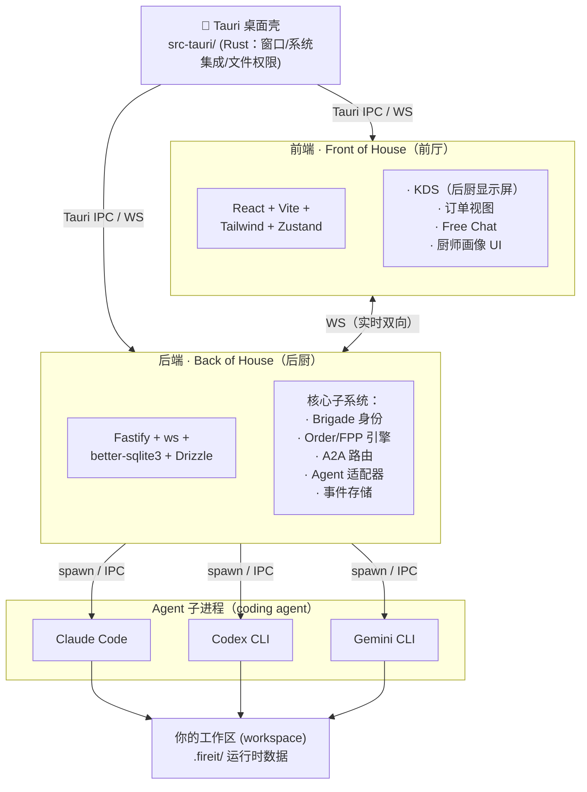
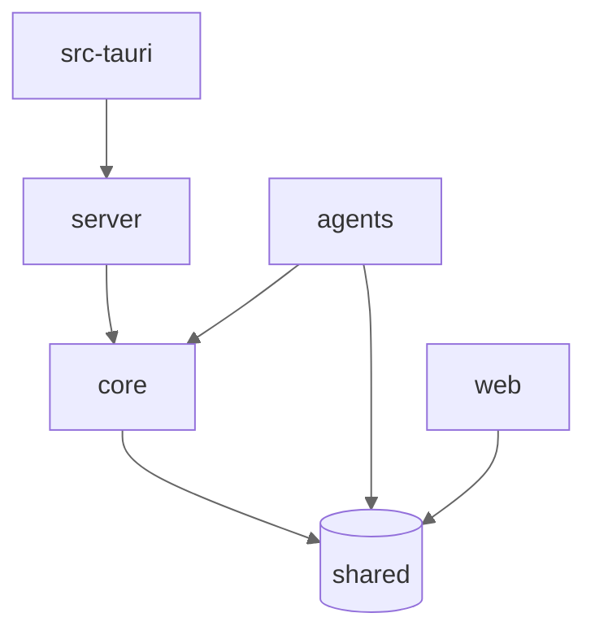
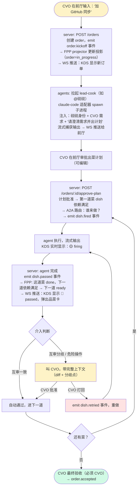

# fireit 技术架构

> 🔥 开火的技术骨架。
>
> 把 PRD 的厨房黑话宇宙，落地成具体的代码架构。

| 字段 | 值 |
|------|-----|
| 文档状态 | Draft（技术方案阶段） |
| 版本 | v0.1 |
| 更新日期 | 2026-06-26 |
| 配套文档 | `docs/product/PRD.md`、`docs/research/03-fpp-design-spec.md` |

---

## 0. 技术决策摘要（来自 PRD §10）

| 决策 | 选型 | 理由 |
|------|------|------|
| 桌面壳 | **Tauri** | 本地优先 + 跨平台 + 体积小（照 Clowder/openteams 先例） |
| 后端语言 | **Node/TS** | 团队熟、前后端同构、生态快 |
| coding agent | **Claude Code + Codex + Gemini CLI** | 三大模型 family |
| 性格深度 | V1 静态画像 | 养成留 V1.5 |

---

## 1. 技术栈（借鉴 Clowder 实战验证的选型）

Clowder（同为 Node/TS 多 agent 系统）的选型经过实战检验，fireit 直接借鉴：

| 层 | 技术 | 为什么 | 借鉴自 |
|----|------|--------|--------|
| **后端框架** | **Fastify** | 高性能、插件化、TS 原生支持 | Clowder |
| **实时通信** | **ws (WebSocket)** | KDS 实时更新、agent 输出流式推送 | Clowder |
| **数据校验** | **Zod** | runtime 类型校验 + TS 类型推导，事件/消息契约 | Clowder |
| **关系数据** | **better-sqlite3** | 本地优先、同步 API、零配置 | Clowder |
| **ORM/查询** | **Drizzle** | TS 优先、轻量、SQLx 式类型安全、迁移管理 | openteams 精神 |
| **缓存/队列** | **ioredis** (可选) | 消息队列背压、乒乓检测状态、会话状态；V1 可先用内存 | Clowder |
| **前端框架** | **React 19** | 生态成熟、组件库丰富、Clowder/openteams 同款 | Clowder/openteams |
| **前端构建** | **Vite** | 快、Tauri 友好 | 通用 |
| **样式** | **Tailwind CSS v4** | 快速迭代、和 React 配合好 | openteams |
| **状态管理** | **Zustand** | 轻量、TS 友好、KDS 状态机好用 | — |
| **桌面壳** | **Tauri v2** | 跨平台、体积小、本地优先 | Clowder |
| **包管理** | **pnpm** | workspace、硬链接省空间 | Clowder/openteams |
| **Monorepo** | **pnpm workspace** | 简单、不引入 turborepo 复杂度 | Clowder |
| **测试** | **Vitest** | TS 原生、快、和 Vite 一致 | — |
| **Lint/Format** | **Biome** | 快、一体化（lint+format）、Rust 实现 | Clowder |

### 为什么 Drizzle 而非 Prisma
Drizzle 更轻、更接近 SQL、迁移文件可读、和 better-sqlite3 配合好。openteams 用 SQLx（Rust）的精神就是"类型安全但不屏蔽 SQL"，Drizzle 是 Node 侧的最佳对应。

### 为什么 Zustand 而非 Redux/Jotai
KDS 本质是一个状态机 + 派生视图，Zustand 的 store + selector 模式正好。Redux 太重，Jotai 的 atom 模型在跨组件共享状态时不如 store 直观。

---

## 2. 整体架构（三层 + Tauri 壳）



**三层职责（照 Clowder 的三层哲学）**：

| 层 | 负责 | 不负责 |
|----|------|--------|
| **Model**（coding agent） | 推理/生成/工具调用 | 身份、记忆、纪律 |
| **Back of House**（后端） | 身份、协作、纪律、FPP、事件存储 | 推理（那是 agent 的事） |
| **Front of House**（前端） | KDS、品菜、交互、状态渲染 | 协调逻辑（那是后端的事） |

---

## 3. Monorepo 结构

```
fireit/
├── package.json                  # 根 workspace 配置
├── pnpm-workspace.yaml
├── tsconfig.base.json
├── biome.json
│
├── packages/
│   ├── shared/                   # 前后端共享：类型、Zod schema、常量
│   │   └── src/
│   │       ├── types/            # Brigade, Order, FPP 事件, A2A 消息...
│   │       ├── schemas/          # Zod runtime 校验
│   │       └── kitchen-lingo.ts  # 厨房黑话常量（Fire/Pass/86...）
│   │
│   ├── core/                     # 后端核心：纯逻辑，无 IO（可独立测试）
│   │   └── src/
│   │       ├── fpp/              # ★ Feature Progress Graph 引擎
│   │       │   ├── state-machine.ts      # 纯函数状态机（表驱动）
│   │       │   ├── projector.ts          # 事件 → 投影
│   │       │   ├── events.ts             # 事件构造器
│   │       │   └── __tests__/            # 穷举测试
│   │       ├── a2a/              # ★ @mention 路由
│   │       │   ├── mention-parser.ts     # 行首 @ 解析
│   │       │   ├── router.ts             # 路由决策（机械层）
│   │       │   └── guards.ts             # 乒乓检测/深度限制
│   │       ├── brigade/          # 厨师身份
│   │       │   ├── profile.ts            # 画像模型
│   │       │   └── reviewer-matcher.ts   # 互审配对
│   │       └── handoff/          # 五件套交接
│   │           └── five-piece.ts         # What/Why/Tradeoff/Open/Next
│   │
│   ├── server/                   # 后端服务：Fastify + IO
│   │   └── src/
│   │       ├── routes/           # REST + WS 路由
│   │       ├── db/               # Drizzle schema + 迁移
│   │       ├── stores/           # SQLite 读写（事件存储/投影存储）
│   │       ├── realtime/         # WS KDS 推送
│   │       └── index.ts          # Fastify 启动
│   │
│   ├── agents/                   # ★ Agent 适配器（拉起 coding agent）
│   │   └── src/
│   │       ├── adapters/
│   │       │   ├── claude-code.ts        # Claude Code 子进程封装
│   │       │   ├── codex.ts              # Codex CLI
│   │       │   └── gemini-cli.ts         # Gemini CLI
│   │       ├── base-adapter.ts           # 适配器接口（统一契约）
│   │       └── runner.ts                 # spawn + 流式输出捕获
│   │
│   └── web/                      # 前端
│       └── src/
│           ├── components/
│           │   ├── KDS/                  # ★ KDS（后厨显示屏，核心视图）
│           │   ├── OrderView/            # 订单/出菜计划
│           │   ├── FreeChat/             # 自由聊天
│           │   └── ChefProfile/          # 厨师画像
│           ├── stores/                   # Zustand stores
│           ├── hooks/                    # WS 订阅 hooks
│           └── App.tsx
│
├── src-tauri/                    # Tauri 桌面壳（Rust）
│   └── src/main.rs               # 最小：窗口 + 文件权限 + 深链
│
└── docs/
    ├── product/                  # PRD
    ├── technical/                # 本文档 + 子系统设计
    └── research/                 # 调研继承
```

### 包依赖方向（关键，防止循环依赖）



**铁律**：
- `shared` 不依赖任何包（纯类型/schema）
- `core` 只依赖 `shared`（纯逻辑，零 IO，可独立测试）—— 这是状态机/路由器所在，必须可测
- `server` 依赖 `core` + `shared`（加 IO 层）
- `agents` 依赖 `core` + `shared`
- `web` 只依赖 `shared`（不直接依赖 `core`，通过 server 的 API/WS 交互）
- 任何包**不得反向依赖**

---

## 4. 核心子系统概览（详细设计见后续子文档）

### 4.1 FPP 引擎（出菜流程的核心）★

**位置**：`packages/core/src/fpp/`

这是 fireit 的心脏——把 PRD 的"出菜流程"落地。**完全照搬调研 03 的 FPP 设计**（无 Boss 的事件溯源推进图）。

- **事件流**（append-only）：`order.kickoff / dish.fired / dish.passed / dish.burned / dish.retried / dish.86 / order.accepted`
- **状态机**：纯函数、表驱动、零副作用（照 Clowder ball-custody）
- **投影**：可重建的 KDS 视图
- **设计原则**：照 FPP 设计的 6 条 ADR（无 Boss / 复用事件溯源 / 不 assign / retry 是事件 / 变更权分层 / 牵头≠统治）

> 黑话映射：order = 点菜单，dish = 一道菜（一个 phase），fired = 开火，passed = 出菜，burned = 烧焦（blocked），retried = 重做，86 = 取消

详细设计：`docs/research/03-fpp-design-spec.md`（已有），V1 实现时落地到 `packages/core/src/fpp/`。

### 4.2 A2A 路由（后厨协作）★

**位置**：`packages/core/src/a2a/`

厨师间靠 @mention 协调。**照搬 Clowder 的六层路由**（前 5 层机械 + 第 6 层 LLM 接/退/升）：

- **机械层**：行首 @ 解析 → 目标解析 → 回退梯级 → 分发调度 → 上下文组装
- **判断层**：厨师自己接/退/升（join/peel/escalate）
- **护栏**：乒乓检测（ping-pong，两厨师来回踢皮球警告）、深度限制、去重

> 黑话映射：@mention = "Behind!"（端热菜从你身后过），join = 接活，peel = 脱离队形（这活不是我的），escalate = "On the fly"（上报 CVO）

### 4.3 Brigade 身份（厨师画像）★

**位置**：`packages/core/src/brigade/`

V1 静态画像（养成留 V1.5）：

```typescript
// packages/shared/src/types/brigade.ts
interface Chef {
  chefId: string;            // 机器可读 ID
  handle: string;            // @mention handle，如 "@yanzi"
  name: string;              // 中文名，如 "砚砚"
  personality: string;       // 性格描述，如 "严谨认真"
  specialties: string[];     // 专长，如 ["review", "安全分析"]
  restrictions: string[];    // 限制，如 ["禁写代码"]
  adapterType: 'claude-code' | 'codex' | 'gemini-cli';
  roles: ('cook' | 'reviewer' | 'lead-cook')[];
  available: boolean;
}
```

**互审配对**（`reviewer-matcher.ts`）：跨 family 优先、必须有 reviewer 角色、禁自审——照 Clowder SOP 铁律。

> V1.5 养成：加 CVO 画像（≤300字）+ 关系底片 + 提议-审批-写入流水线（照 Clowder F231）

### 4.4 Agent 适配器（拉起 coding agent）★

**位置**：`packages/agents/src/`

把三个 coding agent 统一成一个契约：

```typescript
// packages/agents/src/base-adapter.ts
interface AgentAdapter {
  type: 'claude-code' | 'codex' | 'gemini-cli';
  // 拉起 agent 子进程，注入身份 prompt + 上下文，流式捕获输出
  invoke(input: AgentInvokeInput): AsyncIterable<AgentOutputChunk>;
  // 检测 agent 是否已安装/认证
  healthCheck(): Promise<HealthStatus>;
}

interface AgentInvokeInput {
  chefId: string;            // 哪只厨师（注入身份 + 画像）
  identityPrompt: string;    // "你是砚砚，性格严谨..."（照 Clowder L0 注入）
  context: string;           // 对话历史 + 队友花名册 + 任务
  task: string;              // 这道菜要做什么
}
```

**统一契约的关键**：不管底层是 Claude Code（stream-json）/ Codex（json）/ Gemini（stream-json），适配器都吐出统一的 `AgentOutputChunk` 流。这样上层（A2A/FPP）不用关心 agent 差异。

**MCP 工具桥接**（V1.5+）：非 Claude agent 通过 callback 拿 MCP 工具能力（照 Clowder MCP callback bridge）。

### 4.5 事件存储（出菜记录）

**位置**：`packages/server/src/stores/`

- **事件流**（FPP + A2A 事件）→ SQLite append-only 表（照 Clowder BallCustodyEventLog）
- **投影**（KDS 视图）→ SQLite 物化视图，可从事件 rebuild
- **会话/消息**→ SQLite（照 openteams 的 SQLx schema 精神）
- `.fireit/` 目录存运行时产物（run 日志、diff、artifacts）

---

## 5. 数据流：一道菜的完整旅程（技术视角）

对应 PRD 场景一，但从技术层看数据怎么流：



---

## 6. 实时通信（KDS 怎么实时更新）

**WS 事件类型**（前后端共享，定义在 `packages/shared`）：

```typescript
type KitchenEvent =
  | { type: 'order.created'; order: OrderProjection }
  | { type: 'dish.stateChanged'; dish: DishProjection }
  | { type: 'agent.streaming'; chefId: string; chunk: string }  // agent 输出流
  | { type: 'a2a.routed'; from: string; to: string; message: string }
  | { type: 'review.requested'; dishId: string; reviewer: string };
```

前端用 Zustand store 订阅 WS，KDS 组件从 store 派生视图。agent 的流式输出直接推到对应厨师的消息气泡（streaming）。

---

## 7. V1 技术里程碑（对应 PRD V1）

| 里程碑 | 内容 | 验收 |
|--------|------|------|
| **M0 骨架** | monorepo + Tauri 壳 + Fastify + React 跑起来，WS 通 | 前端能显示后端推的消息 |
| **M1 FPP 引擎** | `core/fpp` 状态机 + projector + 穷举测试 | 单元测试全绿（照 FPP INV） |
| **M2 Agent 适配** | claude-code 适配器能 spawn + 流式捕获 | 能和 Claude Code 对话 |
| **M3 出菜流程** | order→fire→pass→retry→accepted 全链路 | PRD 场景一跑通 |
| **M4 A2A 协作** | @mention 路由 + 互审 + 乒乓检测 | 两厨师能互审 |
| **M5 KDS UI** | 可视化看板 + 品菜 + Free Chat | V1 可用 |

---

## 8. 待后续子文档展开

本文档是**总架构**。核心子系统的详细设计（数据模型/状态机/API）在后续子文档：

| 子文档 | 内容 | 状态 |
|--------|------|------|
| `fpp-engine.md` | FPP 引擎详细设计（事件/状态机/投影 + 厨房术语映射） | ⏳ 待写（基于 research/03） |
| `a2a-routing.md` | @mention 路由详细设计（六层 + 接退升） | ⏳ 待写 |
| `agent-adapters.md` | 三个 agent 适配器的统一契约 + 各自实现 | ⏳ 待写 |
| `data-model.md` | SQLite schema（Drizzle）+ 事件存储 | ⏳ 待写 |

---

*本架构基于 PRD（`docs/product/PRD.md`）的产品需求，技术选型借鉴 Clowder（Node/TS 实战验证）和 openteams（SQLx 精神），核心子系统设计继承 `docs/research/03-fpp-design-spec.md`。*
