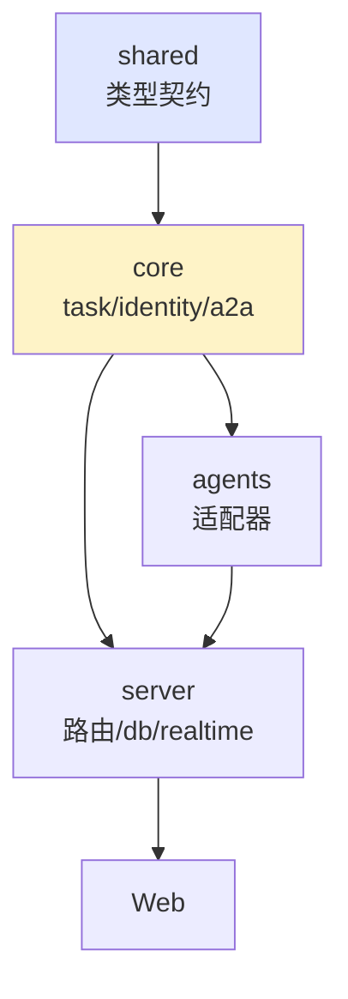

# fireit 子系统详细设计

> 设计级规格：interface / enum / 状态转移表 / 接口签名。不含实现。
>
> 术语以 `docs/product/PRD.md` §1 为准。本文不含品牌黑话。

| 字段 | 值 |
|------|-----|
| 文档状态 | Draft |
| 版本 | v0.1 |
| 更新日期 | 2026-06-26 |
| 配套 | `docs/technical/architecture.md`（总架构）、`docs/product/PRD.md`（需求） |

---

## 目录

1. [shared：类型契约](#1-shared类型契约)
2. [task 引擎：状态机 + 事件 + 投影](#2-task-引擎状态机--事件--投影)
3. [identity：agent 身份 + 互审配对](#3-identityagent-身份--互审配对)
4. [a2a：@mention 路由 + 护栏](#4-a2acomment-路由--护栏)
5. [agents：coding agent 适配器](#5-agentscoding-agent-适配器)
6. [server：路由 + db schema + realtime](#6-server路由--db-schema--realtime)
7. [web：board / review / chat](#7-webboard--review--chat)

---

## 1. shared：类型契约

`packages/shared/src/types/`。所有包的根基，纯类型 + Zod schema，零依赖。

### 1.1 基础实体

```typescript
// agent.ts
type AgentId = string;          // 机器可读，如 "agent_atlas"
type AgentHandle = string;      // @mention，如 "@atlas"

type AdapterType = 'claude-code' | 'codex' | 'gemini-cli';
type ModelFamily = 'claude' | 'gpt' | 'gemini';

interface Agent {
  agentId: AgentId;
  handle: AgentHandle;
  name: string;                 // 显示名
  role: string;                 // 角色描述
  specialties: string[];
  restrictions: string[];
  adapterType: AdapterType;
  modelFamily: ModelFamily;
  roles: AgentRole[];
  available: boolean;
}

type AgentRole = 'member' | 'reviewer' | 'lead';
```

```typescript
// task.ts
type TaskId = string;
type StepId = string;

interface Task {
  taskId: TaskId;
  title: string;
  vision: string;               // 任务目标（对齐 VISION：可验收）
  status: TaskStatus;
  leadAgentId: AgentId | null;  // 任务级 lead（§4.7）
  createdAt: number;
  acceptedAt: number | null;
}

interface Step {
  stepId: StepId;
  taskId: TaskId;
  title: string;
  instruction: string;          // 该 step 要做什么
  acceptance: string;           // 验收标准
  assignedAgentId: AgentId | null;  // 建议执行者（非强制分派）
  dependencies: StepId[];       // 依赖的其他 step
  status: StepStatus;
  retryCount: number;
  order: number;                // 显示顺序
}

type TaskStatus = 'pending' | 'in_progress' | 'accepted' | 'archived';
type StepStatus =
  | 'pending'        // 依赖未满足
  | 'ready'          // 依赖满足，可执行
  | 'running'        // 执行中
  | 'blocked'        // 阻塞
  | 'completed'      // 完成
  | 'skipped'        // 跳过
  | 'retried';       // 被 retry 重置（瞬态→running）
```

### 1.2 事件（append-only）

```typescript
// events.ts
type TaskEventKind =
  | 'task.created'
  | 'task.planApproved'      // plan 审批通过，进入执行
  | 'step.started'           // agent 开始执行
  | 'step.completed'         // 完成
  | 'step.blocked'           // 阻塞
  | 'step.unblocked'         // 阻塞解除
  | 'step.retried'           // step 级 retry
  | 'step.skipped'           // 跳过（需审批）
  | 'task.accepted'          // 最终验收（必须 user）
  | 'task.archived';

type EventClassification = 'state-changing' | 'informational';

interface TaskEvent {
  eventId: string;            // 幂等去重键
  taskId: TaskId;
  kind: TaskEventKind;
  classification: EventClassification;
  payload: TaskEventPayload;
  at: number;                 // ms timestamp
}

interface TaskEventPayload {
  stepId?: StepId;
  agentId?: AgentId;
  by?: AgentId | 'user';      // 谁触发的
  evidence?: string;          // 完成证据（diff/报告引用）
  reason?: string;            // blocked/retried/skipped 原因
  approver?: AgentId | 'user';// skipped 审批人
  plan?: StepSpec[];          // task.created / planApproved 携带
}

// plan 的规格定义（创建时用）
interface StepSpec {
  title: string;
  instruction: string;
  acceptance: string;
  assignedAgentId: AgentId | null;
  dependencies: number[];     // 引用 plan 内 index
}
```

### 1.3 review / 决策记录

```typescript
// review.ts
type ReviewVerdict = 'approved' | 'rejected' | 'needs_human';

interface ReviewRecord {
  reviewId: string;
  stepId: StepId;
  reviewerAgentId: AgentId;   // 互审的 reviewer
  authorAgentId: AgentId;     // 被审的 author
  verdict: ReviewVerdict;
  findings: ReviewFinding[];
  decisionBasis: string;      // 决策依据（VISION：必须保留）
  at: number;
}

interface ReviewFinding {
  severity: 'p1' | 'p2' | 'p3';   // p1=阻塞
  description: string;
}

// 介入决策（系统判断是否叫人）
interface InterventionDecision {
  stepId: StepId;
  trigger: InterventionTrigger;
  needsHuman: boolean;
  basis: string;              // 决策依据
  at: number;
}

type InterventionTrigger =
  | 'review_consensus'        // 互审一致 → 不叫人
  | 'review_disagreement'     // 互审分歧 → 叫人
  | 'dangerous_op'            // 危险操作 → 必叫
  | 'final_acceptance';       // 终局 → 必叫
```

---

## 2. task 引擎：状态机 + 事件 + 投影

`packages/core/src/task/`。事件溯源，纯函数，零 IO。

### 2.1 Step 状态转移表

| 当前状态 \ 事件 | started | completed | blocked | unblocked | retried | skipped |
|----------------|---------|-----------|---------|-----------|---------|---------|
| pending | reject | reject | reject | reject | reject | reject |
| ready | → running | reject | reject | reject | reject | → skipped* |
| running | reject | → completed | → blocked | reject | reject | reject |
| blocked | reject | reject | reject | → running | reject | → skipped* |
| completed | reject | reject | reject | reject | → running | reject |
| skipped | reject | reject | reject | reject | reject | reject |

`*skipped` 需审批（payload.approver 必填，否则 reject `unauthorized`）。

### 2.2 Task 状态派生（从 step 状态聚合）

| step 状态集合 | task 状态 |
|--------------|-----------|
| 全 pending | pending |
| 任一 running/blocked | in_progress |
| 全 completed/skipped | → 触发最终验收检查 |
| user.accepted | accepted |

**最终验收前置**：所有 step ∈ {completed, skipped}，且 task.accepted 必须 `by: 'user'`。

### 2.3 核心接口签名

```typescript
// state-machine.ts（纯函数）
interface TransitionResult {
  ok: boolean;
  next?: StepStatus;          // 成功的下一状态
  reason?: TransitionReject;  // 失败原因
}
type TransitionReject =
  | 'invalid_transition'
  | 'dependency_not_satisfied'
  | 'unauthorized'             // skipped 无 approver / accepted 非 user
  | 'bad_payload';

function transition(
  current: StepStatus,
  event: TaskEvent,
  snapshot: { dependencies: StepId[]; allStepStatus: Record<StepId, StepStatus> },
): TransitionResult;

// projector.ts（事件 → 投影，零副作用）
interface TaskProjection {
  task: Task;
  steps: Step[];
  readySteps: StepId[];       // 依赖满足、可执行的
  blockedSteps: StepId[];
  pendingInterventions: InterventionDecision[];
}

function applyEvent(proj: TaskProjection, event: TaskEvent): TaskProjection;
function rebuild(events: TaskEvent[]): TaskProjection;  // replay
```

### 2.4 不变量（INV）

| ID | 不变量 |
|----|--------|
| INV-T1 | 全 step 状态 × 全事件每格行为确定，穷举测试 |
| INV-T2 | rebuild(replay) 逐字段相同，零漂移 |
| INV-T3 | 事件不可变，永不从 log 删除 |
| INV-T4 | step.started 前依赖必须全 completed/skipped |
| INV-T5 | task.accepted 必须 `by: 'user'` 且所有 step closed |
| INV-T6 | step.skipped 必须有 approver |
| INV-T7 | projector 零外部副作用 |

---

## 3. identity：agent 身份 + 互审配对

`packages/core/src/identity/`。

### 3.1 team 管理

```typescript
interface TeamRegistry {
  register(agent: Agent): void;
  get(agentId: AgentId): Agent | undefined;
  getByHandle(handle: AgentHandle): Agent | undefined;
  listAvailable(): Agent[];
  listByRole(role: AgentRole): Agent[];
}
```

### 3.2 互审配对规则

```typescript
// reviewer-matcher.ts
interface ReviewerMatchResult {
  reviewer: Agent | null;
  reason: string;             // 为什么选这个 / 为什么没有
}

function matchReviewer(
  authorAgentId: AgentId,
  registry: TeamRegistry,
): ReviewerMatchResult;
```

**配对优先级**（从高到低）：

| 优先级 | 条件 |
|--------|------|
| 1 | 跨 modelFamily + 有 reviewer 角色 + available |
| 2 | 同 modelFamily 不同 agentId + reviewer + available |
| 3 | 降级：任一 available 的 reviewer |
| — | 铁律：reviewer.agentId ≠ author.agentId（禁自审） |

### 3.3 lead agent 选拔

```typescript
function suggestLead(
  taskVision: string,
  registry: TeamRegistry,
): Agent | null;
// 默认规则：有 lead 角色 + available + 专长匹配度最高
// 最终由 user 确认或改派
```

---

## 4. a2a：@mention 路由 + 护栏

`packages/core/src/a2a/`。六层流水线，前 5 层机械 + 第 6 层 LLM 判断。

### 4.1 路由流水线

```typescript
interface RouteInput {
  text: string;               // 含 @mention 的消息
  threadId: string;
  senderId: AgentId | 'user';
}

interface RouteResult {
  targets: AgentId[];         // 路由目标
  fallbackUsed: FallbackStrategy | null;
  warnings: RouteWarning[];
}

type FallbackStrategy =
  | 'explicit_mention'        // 显式 @（最高优先）
  | 'recent_user_mention'     // 最近 user 消息里的 @
  | 'last_responder'          // 最后回复的 agent
  | 'thread_default'          // 线程默认 agent
  | 'system_default';         // 全局兜底
```

### 4.2 六层职责

| 层 | 职责 | 纯函数 |
|----|------|--------|
| 1 提及解析 | 行首 @ 解析，去代码块/URL | `parseMentions(text): AgentHandle[]` |
| 2 目标解析 | handle → agentId，校验 available | `resolveTargets(handles, registry)` |
| 3 回退梯级 | 无显式 @ 时的 fallback 链 | `applyFallback(input, history)` |
| 4 分发调度 | 串行/并行，去重 | `dispatch(targets, mode)` |
| 5 上下文组装 | 对话历史 + team 名册 + identity | `assembleContext(target, thread)` |
| 6 LLM 判断 | agent 自己 join/peel/escalate | （非代码，prompt 约束） |

### 4.3 护栏

```typescript
interface RouteGuardConfig {
  maxMentionTargets: number;       // 每条消息最多 2
  maxA2ADepth: number;             // 链深度上限 10
  pingPongThreshold: number;       // 同对来回 N 轮警告
  mentionTimeoutMs: number;        // 3-20 分钟
}
```

| 护栏 | 实现 |
|------|------|
| 深度限制 | 每个 thread 计 agent 调用栈深度，超限 reject |
| 去重 | 同轮同 target 合并 |
| 乒乓检测 | 统计 (A,B) 对连续弹跳次数，超阈值注入 warning |

---

## 5. agents：coding agent 适配器

`packages/agents/src/`。统一契约，屏蔽三个 coding agent 差异。

### 5.1 统一接口

```typescript
interface AgentAdapter {
  type: AdapterType;
  invoke(input: AgentInvokeInput): AsyncIterable<AgentOutputChunk>;
  healthCheck(): Promise<HealthStatus>;
}

interface AgentInvokeInput {
  agentId: AgentId;
  identityPrompt: string;      // 身份注入（"你是 Atlas，角色..."）
  context: string;             // 对话历史 + team 名册 + task 上下文
  task: string;                // 当前 step 指令
}

type AgentOutputChunk =
  | { kind: 'text'; content: string }
  | { kind: 'tool_call'; tool: string; args: unknown }
  | { kind: 'file_change'; path: string; diff: string }
  | { kind: 'done'; summary: string }
  | { kind: 'error'; message: string };

interface HealthStatus {
  installed: boolean;
  authenticated: boolean;
  version?: string;
}
```

### 5.2 三个适配器的差异处理

| 适配器 | 输出格式 | spawn 方式 | 认证 |
|--------|---------|-----------|------|
| claude-code | stream-json | 子进程 + `--output-format stream-json` | API key / subscription |
| codex | json | 子进程 + `--json` | API key |
| gemini-cli | stream-json | 子进程 + ACP/`--output-format` | API key / Google 账号 |

适配器内部把各格式归一化成 `AgentOutputChunk`。上层（task/a2a）只消费统一流。

### 5.3 runner

```typescript
class AgentRunner {
  // spawn 子进程，注入 identity，流式捕获，归一化输出
  run(input: AgentInvokeInput, adapter: AgentAdapter): AsyncIterable<AgentOutputChunk>;
  // 中断当前执行（user 打回 / retry）
  abort(agentId: AgentId): void;
}
```

---

## 6. server：路由 + db schema + realtime

`packages/server/src/`。Fastify + ws + better-sqlite3 + Drizzle。

### 6.1 REST 路由

```typescript
// task 流程
POST   /tasks                          // 创建 task（含 StepSpec plan）
GET    /tasks/:id                      // 取 task + steps 投影
POST   /tasks/:id/approve-plan         // user 审批 plan
POST   /tasks/:id/steps/:sid/start     // agent 开始 step
POST   /tasks/:id/steps/:sid/complete  // agent 完成 step
POST   /tasks/:id/steps/:sid/block     // agent 报阻塞
POST   /tasks/:id/steps/:sid/retry     // retry 该 step
POST   /tasks/:id/steps/:sid/skip      // 跳过（需 approver）
POST   /tasks/:id/accept               // 最终验收（必须 user）

// team 管理
GET    /agents
POST   /agents                         // 创建 agent
PUT    /agents/:id                     // 更新 agent

// review
POST   /steps/:sid/review              // 提交互审结果
GET    /steps/:sid/interventions       // 查介入决策

// chat（free chat 模式）
POST   /threads/:tid/messages          // 发消息（含 @mention）
```

### 6.2 SQLite schema（Drizzle）

```typescript
// 核心表
tasks        (id, title, vision, status, lead_agent_id, created_at, accepted_at)
steps        (id, task_id, title, instruction, acceptance, assigned_agent_id,
              dependencies_json, status, retry_count, order_idx)
agents       (id, handle, name, role, specialties_json, restrictions_json,
              adapter_type, model_family, roles_json, available)
task_events  (id, task_id, kind, classification, payload_json, at)  -- append-only
reviews      (id, step_id, reviewer_id, author_id, verdict, findings_json,
              decision_basis, at)
interventions(id, step_id, trigger, needs_human, basis, at)
messages     (id, thread_id, sender_id, text, mentions_json, at)
runs         (id, task_id, step_id, agent_id, status, log_path, token_usage, at)
```

### 6.3 realtime（WS）

```typescript
// WS 事件（对齐 architecture.md §6）
type WorkspaceEvent =
  | { type: 'task.created'; task: TaskProjection }
  | { type: 'step.stateChanged'; step: StepProjection }
  | { type: 'agent.streaming'; agentId: AgentId; chunk: AgentOutputChunk }
  | { type: 'a2a.routed'; from: AgentId | 'user'; to: AgentId; message: string }
  | { type: 'review.requested'; stepId: StepId; reviewer: AgentId }
  | { type: 'intervention.needed'; stepId: StepId; decision: InterventionDecision };

interface RealtimeBroadcaster {
  broadcast(event: WorkspaceEvent): void;
  subscribe(clientId: string): void;
}
```

---

## 7. web：board / review / chat

`packages/web/src/`。React + Zustand。

### 7.1 视图组件

```typescript
// 核心视图
<Board />              // 所有 task/step 的共享看板（支柱一的载体）
<TaskView />           // 单 task 的 plan + step 列表
<ReviewCard />         // 互审结果 + 介入决策（支柱二的载体）
<FreeChat />           // free chat 模式（@mention 轻协作）
<AgentProfile />       // agent 身份展示
<PlanEditor />         // plan 审批/编辑（user 在执行前调整）
```

### 7.2 状态 store

```typescript
interface BoardStore {
  tasks: TaskProjection[];            // 从 WS 订阅
  streamingChunks: Record<AgentId, AgentOutputChunk[]>;  // agent 流式输出
  pendingInterventions: InterventionDecision[];          // 待 user 处理
  // actions
  approvePlan(taskId: string): Promise<void>;
  acceptTask(taskId: string): Promise<void>;
  retryStep(taskId: string, stepId: string): Promise<void>;
}
```

### 7.3 介入交互（支柱二落地）

当 `intervention.needed` 事件到达时：

```typescript
// 介入卡必须展示完整上下文（VISION §3 支柱二约束）
<InterventionCard
  stepId={step.stepId}
  title={step.title}
  diff={run.diff}                    // 改了什么
  reviewFindings={review.findings}   // 互审分歧点
  decisionBasis={decision.basis}     // 为什么叫你
  actions={['approve', 'reject', 'retry']}
/>
```

---

## 附录：子系统依赖关系



---

*本文是各子系统的设计级规格。实现时以此为准，变量名/接口签名直接对齐。*
